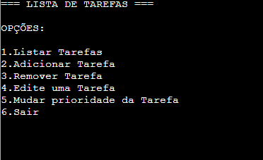

# 📝 To-Do List in Swift

## 🖥 Interface (Terminal)

## 📃 Summary
This is a simple to-do list project made in Swift, which runs directly in the terminal. The goal is to practice basic language structures such as lists, functions, optionals, flow control, and data input.

## 📌 Features

- 📋 List tasks
- ➕ Add new tasks
- ❌ Remove tasks by index
- ✏️ Edit existing tasks
- 🔃 Change the priority (position) of tasks
- 🚪 Exit the program

## 🧠 Logic

- The program works with a "while true" loop that displays a menu of options to the user and responds according to the entered input. Tasks are stored in an array of strings called "ListadeTarefas".

## 📂 Code Organization

- Functions such as adicionarTarefas, removerTarefa, editarTarefa, etc., manipulate a copy of the array and return the updated version
- The main list is kept in the global variable listadeTarefas
- Operations are performed with interactive input via readLine()

## 🚀 Possible Improvements

- Save tasks to a file (data persistence)
- Validate invalid indexes before removing or editing
- Create a graphical interface (using SwiftUI, for example)

## 👨‍💻 Author

- Kemuel Áquila de Matos
